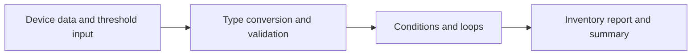

# Lab 2: Introduction to Python for Network Automation

## Duration

**2 hours**

In this lab, you will build a small device-inventory report using Python's core data types, input conversion, conditions, and loops.

## Objectives

- Use Python interactively and as a script.
- Work in a virtual environment.
- Use strings, numbers, Booleans, lists, tuples, dictionaries, sets, and `None`.
- Format output with f-strings.
- Use `if`, `for`, `while`, `break`, and `continue`.
- Validate numeric user input.
- Commit and push the completed program to GitHub.

The program follows a simple input-process-output flow. Validation keeps unsuitable input out of the reporting logic:



## Files

- `inventory_report_starter.py`: starting script.
- `validate_lab2.py`: automated completion check.

## Part 1: Prepare the project

```bash
mkdir -p ~/devnet-associate/labs
cd ~/devnet-associate
git pull --ff-only
cp -R "/path/to/Lab 02 - Introduction to Python" ~/devnet-associate/labs/lab02
cd ~/devnet-associate/labs/lab02
python3 -m venv .venv
source .venv/bin/activate
cp inventory_report_starter.py inventory_report.py
printf '%s\n' '.venv/' '__pycache__/' '*.py[cod]' > .gitignore
code .
```

Select the `.venv` interpreter in VS Code.

Quickly test the interpreter:

```bash
python - <<'PY'
hostname = "edge-r1"
port = 443
enabled = True
print(hostname, port, enabled)
print(type(hostname), type(port), type(enabled))
PY
```

## Part 2: Create the inventory data

Replace TODO 1 in `inventory_report.py`:

```python
course_name = "Cisco DevNet Associate"
site_name = "training-campus"
site_coordinates = (21.0285, 105.8542)
maintenance_mode = False

devices = [
    {
        "name": "edge-r1",
        "role": "router",
        "management_ip": "192.0.2.10",
        "enabled": True,
        "latency_ms": 18.4,
        "tags": ["wan", "critical"],
    },
    {
        "name": "access-sw1",
        "role": "switch",
        "management_ip": "192.0.2.21",
        "enabled": True,
        "latency_ms": 4.8,
        "tags": ["campus", "access"],
    },
    {
        "name": "lab-fw1",
        "role": "firewall",
        "management_ip": "192.0.2.30",
        "enabled": False,
        "latency_ms": None,
        "tags": ["security", "maintenance"],
    },
]
```

The tuple stores a fixed coordinate pair. The list is an ordered collection, each dictionary represents a device, and `None` represents an unavailable measurement.

## Part 3: Validate input

Replace TODO 2:

```python
while True:
    raw_threshold = input("Latency warning threshold in ms [20]: ").strip()
    if raw_threshold == "":
        warning_threshold = 20.0
        break
    try:
        warning_threshold = float(raw_threshold)
    except ValueError:
        print("Enter a number, such as 20 or 12.5.")
        continue
    if warning_threshold <= 0:
        print("Threshold must be greater than zero.")
        continue
    break
```

Test blank, invalid, zero, and valid input.

## Part 4: Build the report

Replace TODO 3 and TODO 4:

```python
print(f"\n{course_name} inventory")
print(f"Site: {site_name} at {site_coordinates}")
print("-" * 68)

enabled_count = 0
latencies = []
roles = set()

for device in devices:
    roles.add(device["role"])
    if not device["enabled"]:
        state = "DISABLED"
        latency_text = "not measured"
    else:
        state = "ENABLED"
        enabled_count += 1
        latency = device["latency_ms"]
        if latency is None:
            latency_text = "unknown"
        else:
            latencies.append(latency)
            latency_text = f"{latency:.1f} ms"
            if latency > warning_threshold:
                latency_text += " WARNING"

    print(
        f"{device['name']:<14} {device['role']:<10} "
        f"{device['management_ip']:<15} {state:<8} {latency_text}"
    )

print("-" * 68)
print(f"Devices: {len(devices)}")
print(f"Enabled: {enabled_count}")
print(f"Roles: {', '.join(sorted(roles))}")
if latencies:
    print(f"Average measured latency: {sum(latencies) / len(latencies):.1f} ms")
```

Replace TODO 5:

```python
print("\nConnection-attempt simulation")
for attempt in range(1, 4):
    if maintenance_mode:
        print("Maintenance mode; attempts skipped.")
        break
    print(f"Attempt {attempt} of 3")
    if attempt < 3:
        print("  Simulated timeout; retrying.")
        continue
    print("  Simulated connection succeeded.")
```

Run with a threshold of `10`:

```bash
python inventory_report.py
```

## Part 5: Validate and publish

```bash
python -m py_compile inventory_report.py
python validate_lab2.py
git add .gitignore Lab2.md inventory_report.py inventory_report_starter.py validate_lab2.py
git diff --staged
git commit -m "Complete introductory Python inventory report"
git push
git status
```

Confirm on GitHub that `.venv` and cache files were not uploaded.

## Completion criteria

- `python validate_lab2.py` passes.
- The report uses the required data types, conditions, and loops.
- Invalid threshold input does not terminate the program.
- No credential is present in the repository.
- The public GitHub course repository contains the completed script.

## Key takeaways

- Python data types represent different kinds of network information and influence the operations that can be performed safely.
- Conditions select behavior, while loops repeat work across devices or retry attempts.
- User input arrives as text and must be converted and validated before use.
- Lists and dictionaries provide a practical foundation for representing a small network inventory.
- Small validation scripts provide quick, repeatable evidence that a program behaves as intended.
