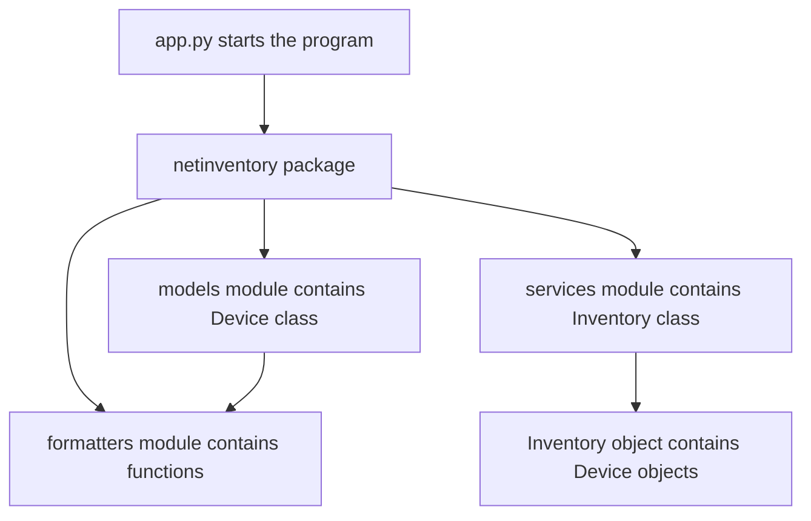

# Lab 3: Introduction to Python Functions, Modules, and Classes

## Duration

**2 hours**

As Python programs grow, placing every statement in one file becomes difficult to read, reuse, and test. This lab introduces three tools for organizing a program: functions, modules, and classes. You will use them to build a small network inventory package from beginner-friendly starter files.

## Objectives

- Explain what a function is and why programs use functions.
- Define functions with parameters, default values, type hints, docstrings, and return values.
- Explain what a module and package are.
- Import functions and classes from other Python files.
- Explain the difference between a class and an object.
- Create a class with attributes and methods.
- Use `__init__()` to set an object's initial state.
- Use `self` to access the current object's attributes and methods.
- Place `Device` objects inside an `Inventory` object.
- Run syntax checks and unit tests.
- Run an application that imports the completed package.

## Why these concepts matter

Functions avoid repeating the same steps. Modules divide a program into files with clear responsibilities. Classes provide a useful way to represent entities that have both information and behavior. In network automation, these concepts can represent devices, credentials, API clients, inventories, configuration tasks, and reports.



## Supplied project

```text
lab03/
├── Lab3.md
├── app.py
├── notes.md
├── netinventory/
│   ├── __init__.py
│   ├── formatters.py
│   ├── models.py
│   └── services.py
└── tests/
    ├── __init__.py
    └── test_netinventory.py
```

The supplied Python files contain `NotImplementedError` placeholders. Replace each placeholder with the code presented in the relevant part. Do not rename functions, classes, or methods because the tests import them by name.

## Part 1: Prepare and inspect the project

```bash
mkdir -p ~/devnet-associate/labs
cd ~/devnet-associate
git pull --ff-only
cp -R "/path/to/Lab 03 - Python Functions Classes and Modules" \
  ~/devnet-associate/labs/lab03
cd ~/devnet-associate/labs/lab03
python3 -m venv .venv
source .venv/bin/activate
printf '%s\n' '.venv/' '__pycache__/' '*.py[cod]' > .gitignore
code .
```

Select the `.venv` Python interpreter in VS Code. Check that Python can parse every starter file:

```bash
python -m compileall -q .
```

Run the tests:

```bash
python -m unittest discover -v
```

Failures are expected because the exercise is unfinished. A useful test failure shows which behavior must be implemented next.

## Part 2: Understand and create functions

A function is a named block of code that performs a task. Defining a function does not run it. The function runs when another statement calls it.

```python
def format_device_label(name: str, role: str = "unknown") -> str:
    return f"{name} [{role}]"


label = format_device_label("edge-r1", "router")
print(label)
```

The example contains:

- `def`, which begins a function definition.
- `format_device_label`, which is the function name.
- `name` and `role`, which are parameters receiving input values.
- `"unknown"`, which is used when the caller omits `role`.
- Type hints showing the expected inputs and returned type.
- `return`, which sends a result back to the caller.

Functions are useful when the same rule is required in several places. If a label format changes, one function can be updated instead of every print statement.

Implement both functions in `netinventory/formatters.py`:

```python
def format_device_label(name: str, role: str = "unknown") -> str:
    """Return a readable label containing a device name and role."""
    return f"{name.strip()} [{role.strip()}]"


def connection_message(name: str, address: str, port: int = 22) -> str:
    """Return a message describing a planned device connection."""
    return f"Connecting to {name.strip()} at {address.strip()}:{port}"
```

Call the functions directly:

```bash
python - <<'PY'
from netinventory.formatters import connection_message, format_device_label

print(format_device_label("edge-r1", "router"))
print(format_device_label("edge-r2"))
print(connection_message("edge-r1", "192.0.2.10"))
print(connection_message("edge-r1", "192.0.2.10", 830))
PY
```

Run the focused tests:

```bash
python -m unittest -v tests.test_netinventory.FunctionTests
```

## Part 3: Understand modules and packages

A module is a Python file containing definitions and statements. In this project, `formatters.py`, `models.py`, and `services.py` are modules. Separating them gives each file a clear purpose:

| Module | Responsibility |
|---|---|
| `formatters.py` | Reusable text-formatting functions |
| `models.py` | The `Device` class |
| `services.py` | The `Inventory` class and inventory searches |

A package is a directory containing related modules. The `netinventory` directory is a package because it contains `__init__.py`. Imports let one module reuse definitions from another:

```python
from .formatters import format_device_label
```

The leading dot means “from this package.” Modules reduce the size of individual files and make responsibilities easier to find. They also allow tests and other applications to import only what they need.

## Part 4: Understand classes and objects

A class is a definition or blueprint. An object is one value created from that class. For example, `Device` is a class, while `edge-r1` and `access-sw1` can be separate `Device` objects.

```text
Device class
├── edge-r1 object
│   ├── name = edge-r1
│   ├── role = router
│   └── enabled = True
└── access-sw1 object
    ├── name = access-sw1
    ├── role = switch
    └── enabled = True
```

An attribute is information stored in an object. A method is a function defined inside a class and called through an object. The special `__init__()` method runs when the object is created. Its `self` parameter refers to that new object.

Implement `Device.__init__()` in `netinventory/models.py`:

```python
def __init__(
    self,
    name: str,
    management_ip: str,
    role: str,
    platform: str = "unknown",
    enabled: bool = True,
) -> None:
    if not isinstance(name, str) or not name.strip():
        raise ValueError("Device name is required")
    if not isinstance(role, str) or not role.strip():
        raise ValueError("Device role is required")
    if not isinstance(enabled, bool):
        raise TypeError("enabled must be a Boolean")

    self.name = name.strip()
    self.management_ip = str(ipaddress.ip_address(management_ip))
    self.role = role.strip()
    self.platform = platform.strip()
    self.enabled = enabled
```

The assignments create attributes on the current object. `ipaddress.ip_address()` checks that the supplied address is valid.

Implement the methods:

```python
def label(self) -> str:
    """Return a readable label for this device."""
    return format_device_label(self.name, self.role)


def disable(self) -> None:
    """Mark this device as unavailable for automation."""
    self.enabled = False


def __repr__(self) -> str:
    """Return a developer-oriented representation of this object."""
    return (
        f"Device(name={self.name!r}, management_ip={self.management_ip!r}, "
        f"role={self.role!r}, platform={self.platform!r}, "
        f"enabled={self.enabled!r})"
    )
```

`label()` returns information without changing the object. `disable()` changes the `enabled` attribute. `__repr__()` helps developers inspect an object in the interpreter and debugger.

```bash
python -m unittest -v tests.test_netinventory.DeviceTests
```

## Part 5: Build a class that contains other objects

The `Inventory` class stores several `Device` objects. This relationship is called composition: an inventory has devices. Composition is useful because each object keeps a focused responsibility. `Device` represents one device; `Inventory` manages a collection.

Implement `Inventory` in `netinventory/services.py`:

```python
def __init__(self, devices: list[Device] | None = None) -> None:
    self._devices = list(devices) if devices is not None else []


def add(self, device: Device) -> None:
    if not isinstance(device, Device):
        raise TypeError("Inventory accepts Device objects only")
    if any(existing.name == device.name for existing in self._devices):
        raise ValueError(f"Duplicate device name: {device.name}")
    self._devices.append(device)


def enabled(self) -> list[Device]:
    return [device for device in self._devices if device.enabled]


def by_role(self, role: str) -> list[Device]:
    return [device for device in self._devices if device.role == role]


def __len__(self) -> int:
    return len(self._devices)
```

The leading underscore in `_devices` tells other programmers that the list is intended for internal class use. `len(inventory)` calls `Inventory.__len__()`.

```bash
python -m unittest -v tests.test_netinventory.InventoryTests
```

## Part 6: Define the package's public imports

Replace `netinventory/__init__.py` with:

```python
"""Public imports for the netinventory package."""

from .formatters import connection_message, format_device_label
from .models import Device
from .services import Inventory

__all__ = ["Device", "Inventory", "connection_message", "format_device_label"]
```

This gives applications a short, clear import:

```python
from netinventory import Device, Inventory, connection_message
```

The internal modules still exist, but the package file identifies the names intended for general use.

## Part 7: Complete the application

Implement `build_inventory()` in `app.py`:

```python
def build_inventory() -> Inventory:
    """Create and return the small training inventory."""
    inventory = Inventory()
    inventory.add(Device("edge-r1", "192.0.2.10", "router", "iosxe"))
    inventory.add(Device("access-sw1", "192.0.2.21", "switch", "iosxe"))
    inventory.add(Device("lab-fw1", "192.0.2.30", "firewall", "ftd", False))
    return inventory
```

Implement `main()`:

```python
def main() -> int:
    """Display the enabled devices in the training inventory."""
    inventory = build_inventory()
    print(f"Inventory devices: {len(inventory)}")
    for device in inventory.enabled():
        print(f"- {device.label()}")
        print(f"  {connection_message(device.name, device.management_ip)}")
    return 0
```

The file ends with:

```python
if __name__ == "__main__":
    raise SystemExit(main())
```

This guard runs `main()` when the file is executed directly, but not when another file imports `app` for testing or reuse.

## Part 8: Check syntax and behavior

```bash
python -m py_compile app.py netinventory/*.py tests/test_netinventory.py
python -m compileall -q .
python -m unittest discover -v
python app.py
```

Expected application output begins with:

```text
Inventory devices: 3
- edge-r1 [router]
  Connecting to edge-r1 at 192.0.2.10:22
```

Complete `notes.md` in your own words. A learner should be able to explain what each concept means without reading a code definition aloud.

## Part 9: Commit and publish

```bash
git status
git add .gitignore Lab3.md app.py netinventory tests notes.md
git diff --staged
git commit -m "Complete beginner functions modules and classes lab"
git push
git status
```

Confirm that `.venv` and Python cache files are not present in GitHub.

## Completion criteria

- The learner can explain why a function is useful.
- Both formatting functions accept parameters and return strings.
- The learner can identify the three modules and the responsibility of each.
- The learner can explain the difference between a class and an object.
- `Device` objects contain attributes and respond to methods.
- `Inventory` contains `Device` objects and can add and search them.
- The package provides clear public imports.
- Python syntax checks complete without errors.
- All unit tests pass.
- `app.py` runs and displays the two enabled devices.

## Further references

- [Defining Python functions](https://docs.python.org/3/tutorial/controlflow.html#defining-functions)
- [Python modules](https://docs.python.org/3/tutorial/modules.html)
- [Python classes](https://docs.python.org/3/tutorial/classes.html)
- [Python unittest framework](https://docs.python.org/3/library/unittest.html)

## Key takeaways

- A function gives a name to reusable behavior and can receive inputs and return a result.
- A module is a Python file, while a package is a directory that groups related modules.
- A class defines attributes and methods; an object is one value created from that class.
- `self` refers to the current object and allows methods to read or change its attributes.
- Composition allows an `Inventory` object to contain and manage several `Device` objects.
- Syntax checks find invalid Python grammar, while unit tests check whether functions and classes behave as expected.
