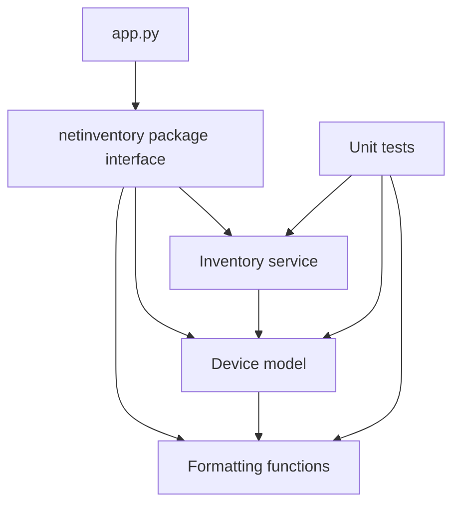

# Lab 3: Python Functions, Classes, and Modules

## Duration

**2 hours**

You will complete a small `netinventory` package by implementing reusable functions, a `Device` class, and an `Inventory` service.

## Objectives

- Define functions with parameters, defaults, type hints, docstrings, and return values.
- Create a class with validated state and methods.
- Use composition to build an inventory from device objects.
- Import local modules through a package interface.
- Run unit tests and publish through GitHub.

The package separates responsibilities so that each component can be understood and tested independently:



## Part 1: Prepare and test

```bash
mkdir -p ~/devnet-associate/labs
cp -R "/path/to/Lab 03 - Python Functions Classes and Modules" ~/devnet-associate/labs/lab03
cd ~/devnet-associate/labs/lab03
python3 -m venv .venv
source .venv/bin/activate
printf '%s\n' '.venv/' '__pycache__/' '*.py[cod]' > .gitignore
git init
git branch -M main
code .
python -m unittest discover -v
```

Failures are expected because the starter code contains `NotImplementedError` placeholders.

## Part 2: Implement formatting functions

In `netinventory/formatters.py`, implement:

```python
def normalize_interface(name: str) -> str:
    """Return a compact, lowercase interface name."""
    cleaned = name.strip().lower().replace(" ", "")
    replacements = {
        "gigabitethernet": "gi",
        "tengigabitethernet": "te",
        "fastethernet": "fa",
        "ethernet": "eth",
    }
    for long_name, short_name in replacements.items():
        if cleaned.startswith(long_name):
            return cleaned.replace(long_name, short_name, 1)
    return cleaned


def format_device_label(name: str, role: str = "unknown") -> str:
    """Return a consistent report label."""
    return f"{name.strip().lower()} [{role.strip().lower()}]"
```

Run:

```bash
python -m unittest -v tests.test_netinventory.FormatterTests
```

## Part 3: Implement the `Device` class

In `netinventory/models.py`, replace the class placeholders:

```python
def __init__(
    self,
    name: str,
    management_ip: str,
    role: str,
    platform: str = "unknown",
    enabled: bool = True,
) -> None:
    self.name = name.strip().lower()
    self.management_ip = str(ipaddress.ip_address(management_ip))
    self.role = role.strip().lower()
    self.platform = platform.strip().lower()
    self.enabled = enabled

def label(self) -> str:
    return format_device_label(self.name, self.role)

def __repr__(self) -> str:
    return (
        f"Device(name={self.name!r}, management_ip={self.management_ip!r}, "
        f"role={self.role!r}, platform={self.platform!r}, "
        f"enabled={self.enabled!r})"
    )
```

Run:

```bash
python -m unittest -v tests.test_netinventory.DeviceTests
```

## Part 4: Implement the composed inventory

In `netinventory/services.py`, implement:

```python
def __init__(self, devices: list[Device] | None = None) -> None:
    self._devices = list(devices) if devices is not None else []

def add(self, device: Device) -> None:
    if not isinstance(device, Device):
        raise TypeError("Inventory accepts Device objects only")
    if any(existing.name == device.name for existing in self._devices):
        raise ValueError(f"Duplicate device name: {device.name}")
    self._devices.append(device)

def enabled(self) -> list[Device]:
    return [device for device in self._devices if device.enabled]

def by_role(self, role: str) -> list[Device]:
    target = role.strip().lower()
    return [device for device in self._devices if device.role == target]

def roles(self) -> set[str]:
    return {device.role for device in self._devices}

def __len__(self) -> int:
    return len(self._devices)
```

`Inventory` has `Device` objects, so composition is more appropriate than inheritance.

```bash
python -m unittest -v tests.test_netinventory.InventoryTests
```

## Part 5: Complete package imports and application

Replace `netinventory/__init__.py`:

```python
from .formatters import format_device_label, normalize_interface
from .models import Device
from .services import Inventory

__all__ = ["Device", "Inventory", "format_device_label", "normalize_interface"]
```

In `app.py`, implement:

```python
def build_inventory() -> Inventory:
    inventory = Inventory()
    inventory.add(Device("edge-r1", "192.0.2.10", "router", "iosxe"))
    inventory.add(Device("access-sw1", "192.0.2.21", "switch", "iosxe"))
    inventory.add(Device("lab-fw1", "192.0.2.30", "firewall", "ftd", False))
    return inventory


def main() -> int:
    inventory = build_inventory()
    print(f"Inventory devices: {len(inventory)}")
    print(f"Roles: {', '.join(sorted(inventory.roles()))}")
    for device in inventory.enabled():
        print(f"- {device.label()} {device.management_ip} {device.platform}")
    return 0
```

Keep the existing `if __name__ == "__main__"` guard.

```bash
python app.py
python -m unittest discover -v
```

## Part 6: Commit and publish

```bash
git add .gitignore Lab3.md app.py netinventory tests notes.md
git diff --staged
git commit -m "Complete modular network inventory application"
gh repo create devnet-associate-lab03 --private --source=. --remote=origin --push
git status
```

## Completion criteria

- All tests pass.
- No `NotImplementedError` remains.
- `Device` validates IP addresses.
- `Inventory` rejects duplicate names and uses composition.
- `app.py` imports through the package interface.
- The private GitHub repository contains the completed project.

## Key takeaways

- Functions package reusable behavior behind clear parameters and return values.
- Classes combine validated state with related behavior; modules and packages organize those definitions.
- Composition allows an `Inventory` to contain `Device` objects without claiming that an inventory is a device.
- A small public package interface makes imports clearer and reduces coupling to internal file locations.
- Unit tests let developers change one component while checking that existing behavior remains intact.
