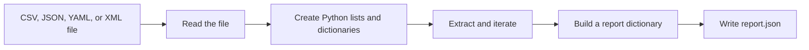

# Lab 4: Working with Data Types and Files in Python

## Duration

**2 hours**

Network automation programs frequently read device information from files, extract selected values, repeat an operation for every record, and save a result for another person or program. This lab introduces that workflow with CSV, JSON, YAML, and XML files containing the same small device inventory.

## Objectives

- Identify Python strings, integers, Booleans, lists, and dictionaries in device data.
- Open and read text files with a context manager.
- Read CSV with the Python `csv` module.
- Read JSON with the Python `json` module.
- Read YAML safely with PyYAML.
- Read XML with `xmltodict`.
- Extract values from lists and dictionaries.
- Iterate over device records with `for` loops.
- Build counters and filtered lists.
- Write a Python dictionary to a formatted JSON file.
- Perform a Python syntax check before running functional tests.

## Data workflow



## Supplied files

```text
lab04/
├── Lab4.md
├── requirements.txt
├── data_pipeline.py
├── observations.md
├── data/
│   ├── devices.csv
│   ├── devices.json
│   ├── devices.yaml
│   └── devices.xml
└── tests/
    └── test_data_pipeline.py
```

`data_pipeline.py` is a starter file. Complete each function as directed and keep the supplied function names so that the tests can import them.

## Part 1: Prepare the project

```bash
mkdir -p ~/devnet-associate/labs
cd ~/devnet-associate
git pull --ff-only
cp -R "/path/to/Lab 04 - Working with Data in Python" \
  ~/devnet-associate/labs/lab04
cd ~/devnet-associate/labs/lab04
python3 -m venv .venv
source .venv/bin/activate
python -m pip install --upgrade pip
python -m pip install -r requirements.txt
printf '%s\n' '.venv/' '__pycache__/' '*.py[cod]' 'output/' > .gitignore
code .
```

Select the `.venv` interpreter in VS Code. Run a syntax check on the unchanged starter file:

```bash
python -m py_compile data_pipeline.py
```

No output means that Python found no syntax error. A syntax check does not prove that the unfinished functions work; it only confirms that Python can parse the file.

## Part 2: Inspect the source data and Python types

Display the four files:

```bash
column -s, -t data/devices.csv
python -m json.tool data/devices.json
cat data/devices.yaml
cat data/devices.xml
```

All four documents describe three devices. Their syntax differs, but the Python program will represent each complete inventory as a list of dictionaries:

```python
devices = [
    {
        "name": "edge-r1",
        "management_ip": "192.0.2.10",
        "role": "router",
        "platform": "iosxe",
        "enabled": True,
        "site": "hanoi",
    }
]
```

Identify the types:

- `devices` is a list.
- `devices[0]` is a dictionary.
- `devices[0]["name"]` is a string.
- `devices[0]["enabled"]` is a Boolean.
- The number returned by `len(devices)` is an integer.

Try the same operations in the Python interpreter:

```bash
python - <<'PY'
device = {
    "name": "edge-r1",
    "management_ip": "192.0.2.10",
    "enabled": True,
}

print(type(device))
print(device["name"], type(device["name"]))
print(device["enabled"], type(device["enabled"]))
print(list(device.keys()))
PY
```

CSV fields and XML element text are read as strings. The strings `"true"` and `"false"` are not Python Booleans, so the program must convert them explicitly.

## Part 3: Convert Boolean text

Implement `parse_bool()` in `data_pipeline.py`:

```python
def parse_bool(value: str) -> bool:
    """Convert the text true or false into a Python Boolean."""
    cleaned = value.strip().lower()
    if cleaned == "true":
        return True
    if cleaned == "false":
        return False
    raise ValueError(f"Expected true or false, received {value!r}")
```

The function strips surrounding whitespace and makes the comparison case-insensitive. It raises an exception instead of silently treating unknown text as `False`.

Run the focused test:

```bash
python -m unittest -v tests.test_data_pipeline.ReaderTests.test_parse_bool
```

## Part 4: Read CSV and JSON

Implement the CSV reader:

```python
def read_csv(path: Path) -> list[dict]:
    """Read device records from CSV."""
    with path.open(newline="", encoding="utf-8") as stream:
        devices = []
        for row in csv.DictReader(stream):
            row["enabled"] = parse_bool(row["enabled"])
            devices.append(row)
    return devices
```

`csv.DictReader` uses the first row as dictionary keys. The loop processes one row at a time and changes only the `enabled` value from text to a Boolean.

Implement the JSON reader:

```python
def read_json(path: Path) -> list[dict]:
    """Read device records from JSON."""
    with path.open(encoding="utf-8") as stream:
        document = json.load(stream)
    return document["devices"]
```

`json.load()` reads from an open file and returns Python objects. The outer document is a dictionary, and the value associated with `"devices"` is the required list.

Test both readers:

```bash
python -m unittest -v \
  tests.test_data_pipeline.ReaderTests.test_csv \
  tests.test_data_pipeline.ReaderTests.test_json
```

## Part 5: Read YAML and XML

Implement the YAML reader:

```python
def read_yaml(path: Path) -> list[dict]:
    """Read device records from YAML."""
    with path.open(encoding="utf-8") as stream:
        document = yaml.safe_load(stream)
    return document["devices"]
```

Use `safe_load()` for ordinary data files. The YAML parser converts `true` and `false` into Python Booleans.

Implement the XML reader:

```python
def read_xml(path: Path) -> list[dict]:
    """Read device records from XML with xmltodict."""
    with path.open(encoding="utf-8") as stream:
        document = xmltodict.parse(stream.read(), force_list=("device",))

    devices = document["inventory"]["device"]
    for device in devices:
        device["enabled"] = parse_bool(device["enabled"])
    return devices
```

XML represents the inventory through nested elements. `xmltodict` converts those elements into nested dictionaries. `force_list=("device",)` ensures that the program receives a list even if a future file contains only one `<device>` element.

Test both readers and automatic reader selection:

```bash
python -m unittest -v \
  tests.test_data_pipeline.ReaderTests.test_yaml \
  tests.test_data_pipeline.ReaderTests.test_xml \
  tests.test_data_pipeline.ReaderTests.test_reader_selection
```

## Part 6: Extract and iterate over device data

Implement `enabled_devices()` with a loop:

```python
def enabled_devices(devices: list[dict]) -> list[dict]:
    """Extract devices whose enabled value is True."""
    result = []
    for device in devices:
        if device["enabled"] is True:
            result.append(device)
    return result
```

Implement `count_roles()`:

```python
def count_roles(devices: list[dict]) -> dict[str, int]:
    """Count devices by role with a loop and dictionary."""
    counts = {}
    for device in devices:
        role = device["role"]
        counts[role] = counts.get(role, 0) + 1
    return counts
```

`counts.get(role, 0)` returns the current count or zero when the role is not yet present. Each loop iteration increases the selected dictionary value by one.

The supplied `build_report()` function also demonstrates extraction with a list comprehension:

```python
"enabled_devices": [device["name"] for device in active]
```

Run the processing tests:

```bash
python -m unittest -v \
  tests.test_data_pipeline.ProcessingTests.test_extract_enabled_devices \
  tests.test_data_pipeline.ProcessingTests.test_count_roles
```

## Part 7: Write the report to a file

Implement `write_report()`:

```python
def write_report(path: Path, report: dict) -> None:
    """Write the report as formatted JSON."""
    path.parent.mkdir(parents=True, exist_ok=True)
    with path.open("w", encoding="utf-8") as stream:
        json.dump(report, stream, indent=2, sort_keys=True)
        stream.write("\n")
```

Creating the parent directory makes the function work when `output/` does not yet exist. `indent=2` makes the JSON readable, and the final newline works well with terminal and version-control tools.

Run the complete program with each input format:

```bash
python data_pipeline.py data/devices.csv --output output/from-csv.json
python data_pipeline.py data/devices.json --output output/from-json.json
python data_pipeline.py data/devices.yaml --output output/from-yaml.json
python data_pipeline.py data/devices.xml --output output/from-xml.json
python -m json.tool output/from-xml.json
```

Each run should report three devices, two enabled devices, and one device for each role.

## Part 8: Check syntax and behavior

Perform the syntax check before running all tests:

```bash
python -m py_compile data_pipeline.py tests/test_data_pipeline.py
python -m compileall -q .
python -m unittest discover -v
```

The distinction is important:

- `py_compile` and `compileall` detect syntax problems.
- Unit tests execute functions and compare their behavior with expected results.
- Running the program confirms that the functions work together as one workflow.

Record the outcome in `observations.md`:

```markdown
# Lab 4 observations

- Input formats tested: CSV, JSON, YAML, XML
- Syntax check result: passed
- Unit test result: passed
- Device count: 3
- Enabled device count: 2
- Output files created: 4
```

## Part 9: Commit and publish

Confirm that generated reports and virtual-environment files are ignored:

```bash
git status --ignored
git add .gitignore Lab4.md requirements.txt data data_pipeline.py tests observations.md
git diff --staged
git commit -m "Complete beginner Python file processing lab"
git push
git status
```

## Completion criteria

- The learner can identify the main Python types used in a device record.
- CSV, JSON, YAML, and XML readers return lists of device dictionaries.
- CSV and XML Boolean text is converted explicitly.
- The program extracts enabled devices and counts devices by role.
- The program iterates over lists and accesses dictionary values by key.
- Four formatted JSON report files are created successfully.
- Python syntax checks complete without errors.
- All unit tests pass.
- Generated output and virtual-environment files are absent from GitHub.

## Further references

- [Python data structures](https://docs.python.org/3/tutorial/datastructures.html)
- [Python file input and output](https://docs.python.org/3/tutorial/inputoutput.html)
- [Python CSV module](https://docs.python.org/3/library/csv.html)
- [Python JSON module](https://docs.python.org/3/library/json.html)
- [PyYAML documentation](https://pyyaml.org/wiki/PyYAMLDocumentation)
- [xmltodict project](https://github.com/martinblech/xmltodict)

## Key takeaways

- Files store text, while parsers convert that text into Python objects such as lists, dictionaries, strings, and Booleans.
- A context manager closes a file automatically after the program finishes reading or writing it.
- Dictionary keys extract named values, and loops apply the same operation to every record in a list.
- CSV and XML commonly require explicit conversion because their values are initially represented as text.
- Writing JSON creates a structured result that people and other programs can read.
- A syntax check finds invalid Python grammar; functional tests determine whether the program behaves correctly.
