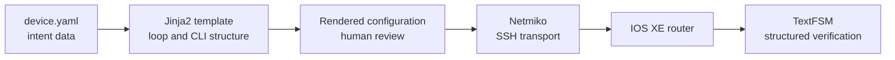

# Lab 7: CLI Automation with Jinja2

## Duration

**2 hours**

Lab 5 built commands in a Python loop. This lab separates data, presentation, and transport: YAML describes the intended interfaces, Jinja2 renders IOS XE CLI, and Netmiko delivers the reviewed configuration. Most importantly, the loop that creates ten interface blocks is inside the Jinja2 template.

## Objectives

- Load and validate loopback metadata from YAML.
- Use variables, filters, and a `for` loop in Jinja2.
- Catch missing template data with `StrictUndefined`.
- Render and review configuration before deployment.
- Deploy with Netmiko and verify with TextFSM.
- Remove only configuration owned by this lab.

## Required environment

Use the Ubuntu workstation and a private, reservable IOS XE sandbox. Connect its VPN and obtain the router address, SSH port, username, and password. Do not use an Always-On device for configuration, alter management connectivity, or save changes to startup configuration.

## Project structure

```text
lab07/
├── Lab7.md
├── requirements.txt
├── .env.example
├── device.yaml
├── common.py
├── render_config.py
├── deploy_config.py
├── verify_interfaces.py
├── cleanup_loopbacks.py
└── templates/
    └── loopbacks.j2
```

## 1. Prepare the project

```bash
cp -R "/path/to/Lab 07 - CLI Automation with Jinja2" ~/devnet-associate/labs/lab07
cd ~/devnet-associate/labs/lab07
python3 -m venv .venv
source .venv/bin/activate
python -m pip install --upgrade pip
python -m pip install -r requirements.txt
printf '%s\n' '.venv/' '__pycache__/' '.env' 'artifacts/' > .gitignore
```

Replace the host and port in `device.yaml`. Then create the protected credential file:

```bash
cp .env.example .env
chmod 600 .env
code .env
```

## 2. Read the template

Open `templates/loopbacks.j2`. Jinja2 statements use `` and expressions use `{{ ... }}`. The `for` statement repeats the complete interface block:

```jinja2

interface Loopback{{ loopback.id }}
 description {{ loopback.description }}
 ip address {{ loopback.ipv4 | address }} {{ loopback.ipv4 | netmask }}
 no shutdown
!

```

Python supplies the collection once; it does not loop to assemble CLI commands. The custom `address` and `netmask` filters convert each CIDR value into the two values IOS XE expects. `StrictUndefined` stops rendering when a required key is missing, which is safer than producing incomplete configuration.



## 3. Render before changing the router

```bash
python render_config.py
less artifacts/rendered-loopbacks.cfg
```

Confirm that the file contains `Loopback701` through `Loopback710`, ten unique `/32` addresses, and no unrelated commands. To see template validation work, temporarily misspell one `description` key in YAML and render again. Restore the key before continuing.

Run the deployment script without `--apply`. This is a second dry run:

```bash
python deploy_config.py
```

## 4. Deploy and verify

After reviewing the rendered output, apply it:

```bash
python deploy_config.py --apply
python verify_interfaces.py
python -m json.tool artifacts/interfaces.json | less
```

The deploy script checks each target first. It refuses an existing interface unless its running configuration contains the exact lab description. Verification parses `show ip interface brief` through TextFSM and reports present and missing interfaces. The `Missing` list should be empty.

Change the description of `Loopback701` in YAML, render again, and compare the new artifact with the previous output. This demonstrates a central benefit of templates: a data change produces predictable CLI while the template remains unchanged. Restore the original description before cleanup.

## 5. Clean up and preserve the work

```bash
python cleanup_loopbacks.py
python cleanup_loopbacks.py --apply
python verify_interfaces.py
```

After cleanup, all ten interfaces should appear in `Missing`. Review `git status` and confirm that `.env` and runtime artifacts are ignored. Commit the reusable files to the private GitHub repository created in Lab 1:

```bash
git add .
git commit -m "Complete Lab 7 Jinja2 CLI automation"
git push
```

## Completion criteria

- The loop is in `templates/loopbacks.j2`, not in Python command-generation code.
- The rendered artifact contains ten correct interface blocks.
- Netmiko deploys the approved configuration without saving it to startup configuration.
- TextFSM confirms all interfaces after deployment and their absence after cleanup.
- Credentials and runtime artifacts are not committed.

## Further references

- [Jinja template designer documentation](https://jinja.palletsprojects.com/en/stable/templates/)
- [Netmiko documentation](https://ktbyers.github.io/netmiko/)
- [Cisco IOS XE reservable sandboxes](https://developer.cisco.com/docs/ios-xe-voip/sandbox/)
