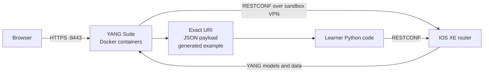

# Lab 8: RESTCONF Automation with Cisco YANG Suite

## Duration

**2 hours**

Lab 7 expressed intent as YAML, rendered device-specific CLI, and transported that CLI over SSH. This lab keeps the same intent but replaces CLI with model-driven RESTCONF operations. Cisco YANG Suite helps you move from the YANG data model to an exact resource URI and correctly structured JSON payload before Python performs the change.

## Objectives

- Install Docker Engine and the Docker Compose plugin on Ubuntu.
- Run Cisco YANG Suite in containers.
- Import models from a reservable IOS XE device.
- Explore a YANG tree and identify list keys, namespaces, and data types.
- Use YANG Suite to derive and test a RESTCONF URI and JSON payload.
- Create, verify, and remove ten loopbacks with Python `requests`.
- Interpret common RESTCONF response codes and troubleshoot safely.

## Required environment

Use an Ubuntu workstation with administrator access and a private, reservable IOS XE sandbox that supports RESTCONF. Connect its VPN and obtain the management address, RESTCONF port, username, and password. Do not use an Always-On device for configuration or save lab changes to startup configuration.

## Before you begin: Create the Lab 8 repository

On github.com, select **+ > New repository**, enter `devnet-associate-lab08`, select **Public**, add a README, and select **Create repository**. On the new repository page, select **Code > HTTPS** and copy the URL. Clone the repository before beginning the lab:

```bash
cd ~
git clone https://github.com/YOUR-USERNAME/devnet-associate-lab08.git
```

## 1. Install Docker Engine

Remove conflicting distribution packages if they are installed:

```bash
for pkg in docker.io docker-doc docker-compose docker-compose-v2 podman-docker containerd runc; do
  sudo apt-get remove -y "$pkg"
done
```

Add Docker's official Ubuntu repository and install the engine and Compose plugin:

```bash
sudo apt-get update
sudo apt-get install -y ca-certificates curl
sudo install -m 0755 -d /etc/apt/keyrings
sudo curl -fsSL https://download.docker.com/linux/ubuntu/gpg \
  -o /etc/apt/keyrings/docker.asc
sudo chmod a+r /etc/apt/keyrings/docker.asc

echo "deb [arch=$(dpkg --print-architecture) signed-by=/etc/apt/keyrings/docker.asc] https://download.docker.com/linux/ubuntu $(. /etc/os-release && echo "$VERSION_CODENAME") stable" |
  sudo tee /etc/apt/sources.list.d/docker.list >/dev/null

sudo apt-get update
sudo apt-get install -y docker-ce docker-ce-cli containerd.io \
  docker-buildx-plugin docker-compose-plugin
sudo docker run hello-world
```

Ubuntu 26.04 is newer than some published support matrices. If Docker's repository does not yet publish packages for its release codename, stop and ask the instructor for the course-approved Docker package source; do not substitute an unrelated codename.

The remaining commands are simplest when your account can use Docker without `sudo`:

```bash
sudo usermod -aG docker "$USER"
newgrp docker
docker version
docker compose version
```

Membership in the `docker` group grants root-equivalent control of the workstation. Use it only on the assigned lab machine and follow your organization's workstation policy.

## 2. Install Cisco YANG Suite with Docker

Clone Cisco's repository and start the packaged container environment:

```bash
mkdir -p ~/devnet-tools
cd ~/devnet-tools
git clone https://github.com/CiscoDevNet/yangsuite.git
cd yangsuite/docker
./start_yang_suite.sh
```

The setup script asks for the initial YANG Suite username, password, and email. Create local test certificates when prompted, then let the script create its environment file and start the Compose services. Use the URL printed by the script; a common local address is `https://localhost:8443`. A browser warning is expected when you deliberately chose a locally generated test certificate.

Check the services or stop them later from the same directory:

```bash
docker compose ps
docker compose logs --tail=50
docker compose down
```

YANG Suite runs locally, but its containers still need a route through the sandbox VPN to the router. If device access fails, confirm the VPN remains connected, restart the YANG Suite containers after connecting it, and consult the VPN policy if container traffic is restricted.



## 3. Add the IOS XE device and retrieve its models

Sign in to YANG Suite and use its Setup workspace:

1. Create a device profile using the reservation's management address, RESTCONF port, and credentials. Select the RESTCONF/NETCONF capabilities offered by the current YANG Suite release.
2. Test the profile. A failed test usually indicates an incorrect address or port, expired reservation, VPN route, credentials, TLS trust issue, or disabled RESTCONF service.
3. Create or select a YANG module repository.
4. Retrieve the device's supported YANG modules into that repository. Resolving dependencies may add imported modules such as `iana-if-type` and `ietf-ip`.
5. Create a YANG module set containing `ietf-interfaces`, `ietf-ip`, `iana-if-type`, and their resolved dependencies. If `ietf-interfaces` is not advertised, use the IOS XE native interface model and adapt the supplied lab URI and payload.

The device's advertised models are authoritative. A URI copied from another release may fail because the model, revision, augmentation, or supported data nodes differ.

## 4. Derive the URI from the YANG model

Open the YANG Explorer and inspect this conceptual path:

```text
ietf-interfaces
└── interfaces (container)
    └── interface (list; key = name)
        ├── name
        ├── description
        ├── type
        ├── enabled
        └── ietf-ip:ipv4 (augmentation)
            └── address (list; key = ip)
                ├── ip
                └── netmask or prefix-length
```

The `interface` node is a list, and its `name` leaf is the key. RESTCONF addresses one list entry by adding `=key-value` to the list resource. For the sample model set, that produces:

```text
Collection: /restconf/data/ietf-interfaces:interfaces
Item:       /restconf/data/ietf-interfaces:interfaces/interface=Loopback801
```

In YANG Suite's RESTCONF application or Swagger interface:

1. Select the device, module set, and `ietf-interfaces` resource.
2. Build a read-only `GET` for the interfaces collection.
3. Inspect the generated URL. Confirm the `/restconf/data` root, module prefix, container, list, and encoded list key.
4. Execute the `GET`. Record the HTTP status, response headers, and JSON body.
5. Select `PUT` for one interface list entry and ask YANG Suite to build the body. Add `name`, `description`, `type`, `enabled`, and the IPv4 address node.
6. Compare the generated body with `payloads/interface.json.j2`. Some platform versions use `prefix-length` instead of `netmask`; use the leaf advertised by the router.
7. Save or copy the generated Python example if the plugin offers it. Identify the method, URL, authentication, headers, body, TLS setting, and timeout before comparing it with the lab script.

Do not execute a modifying request in YANG Suite until the URI and payload have been checked. Update `interface_collection_uri`, `interface_item_uri`, and the payload template if the device's model-derived output differs from the supplied `ietf-interfaces` example.

## 5. Prepare and inspect the Python project

Add the supplied Python project to the repository cloned at the beginning of the lab:

```bash
cp -R "/path/to/Lab 08 - RESTCONF Automation with YANG Suite/." \
  ~/devnet-associate-lab08/
cd ~/devnet-associate-lab08
python3 -m venv .venv
source .venv/bin/activate
python -m pip install --upgrade pip
python -m pip install -r requirements.txt
printf '%s\n' '.venv/' '__pycache__/' '.env' 'artifacts/' > .gitignore
cp .env.example .env
chmod 600 .env
code .
```

Set the host and RESTCONF port in `restconf.yaml`; store only the username and password in `.env`. If the sandbox supplies a CA certificate, save it locally and set its path as `LAB_CA_BUNDLE`. The scripts preserve certificate validation and do not use `verify=False`.

Render all ten payloads without contacting the router:

```bash
python render_payloads.py
python -m json.tool artifacts/payloads/Loopback801.json
python configure_loopbacks.py
```

Compare the first artifact and printed URL with YANG Suite. Do not proceed while the namespace, leaf names, list key, or resource path differs.

## 6. Apply the RESTCONF operations

After approval, send one idempotent `PUT` per interface resource:

```bash
python configure_loopbacks.py --apply
python verify_loopbacks.py
```

The request uses Basic authentication over HTTPS and the media type `application/yang-data+json`. Depending on the resource state and platform, a successful `PUT` commonly returns `200 OK`, `201 Created`, or `204 No Content`. Verification expects `200 OK`; `404 Not Found` means that the addressed entry does not exist.

Use the complete error response when troubleshooting:

| Status | Interpretation and first check |
|---|---|
| `400 Bad Request` | JSON shape, namespace, value type, or required leaf is invalid. Compare the body with the YANG tree. |
| `401 Unauthorized` | Credentials are missing or rejected. Check `.env` and the active reservation. |
| `403 Forbidden` | Authentication succeeded but the account or datastore policy denies the operation. |
| `404 Not Found` | URI, module prefix, path, or list key is wrong, or the item is absent during verification. |
| `405 Method Not Allowed` | The selected method is not valid for that resource. Rebuild the operation in YANG Suite. |
| `409 Conflict` | The requested state conflicts with existing configuration or model constraints. Read the RESTCONF error body. |
| `415 Unsupported Media Type` | Check `Content-Type: application/yang-data+json`. |

RESTCONF error bodies often contain an `ietf-restconf:errors` structure with an error tag, path, and message. These model-aware details are more reliable than guessing from the status alone.

## 7. Clean up and preserve the work

Preview every target before deletion, then remove only entries whose returned data contains the exact lab description:

```bash
python cleanup_loopbacks.py
python cleanup_loopbacks.py --apply
python verify_loopbacks.py
```

The final `Missing` list should contain all ten lab interfaces. Restore the device `host` in `restconf.yaml` to `REPLACE_WITH_RESERVED_ROUTER_ADDRESS`. Confirm `.env`, CA material, and runtime artifacts are ignored, then commit the reusable code to the public Lab 8 GitHub repository:

```bash
git add .
git commit -m "Complete Lab 8 RESTCONF and YANG Suite automation"
git push
```

## Completion criteria

- Docker and YANG Suite run successfully on the assigned workstation.
- The router profile and supported YANG module set are visible in YANG Suite.
- The RESTCONF URI and JSON payload are derived and tested against the current device model.
- Python creates and verifies ten loopbacks through RESTCONF.
- Cleanup removes only the lab-owned resources.
- No credentials, certificates, or runtime evidence are committed.

## Further references

- [Docker Engine installation on Ubuntu](https://docs.docker.com/engine/install/ubuntu/)
- [Cisco YANG Suite documentation](https://developer.cisco.com/docs/yangsuite/)
- [Cisco YANG Suite source repository](https://github.com/CiscoDevNet/yangsuite)
- [Cisco IOS XE RESTCONF API documentation](https://developer.cisco.com/docs/ios-xe/)

## Key takeaways

- YANG describes the structure, types, constraints, and keys used to address model-driven configuration and state data.
- YANG Suite helps derive an operation's exact RESTCONF URI and payload from models supported by the current device.
- RESTCONF uses standard HTTPS methods and status codes while exchanging YANG-modeled data.
- Model names, revisions, augmentations, and leaf choices can vary, so copied URIs must be verified against the target router.
- TLS validation, response-body inspection, pre-checks, and ownership-aware cleanup are essential parts of API automation.
