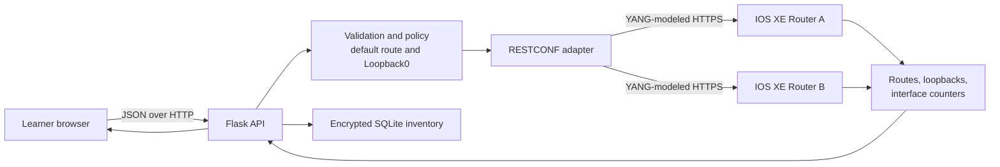
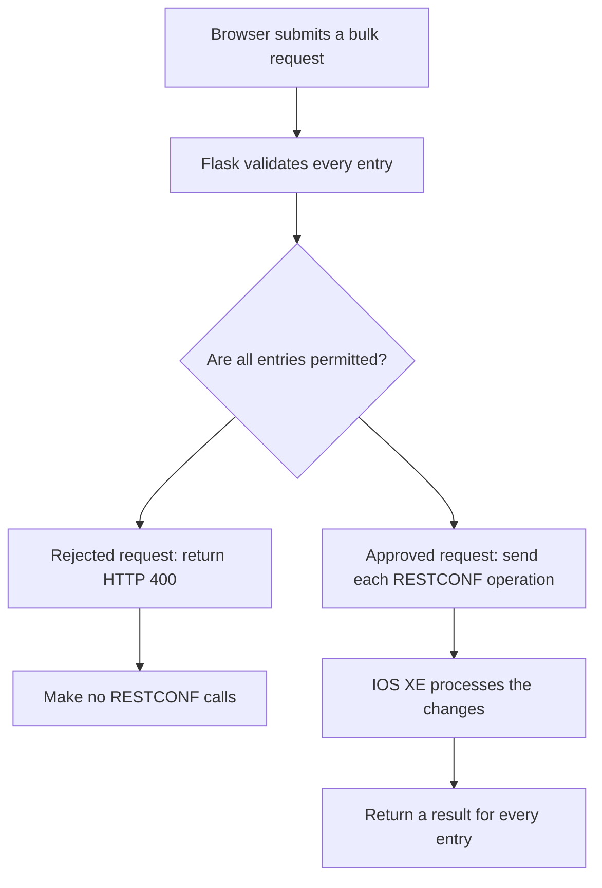

# Lab 9: Build a RESTCONF Management Console with Flask

## Duration

**2 hours**

In Lab 8, each Python script performed one RESTCONF workflow. This lab places those workflows behind a central web console. Learners can select an IOS XE router, retrieve static routes and loopbacks, submit several changes together, and observe GigabitEthernet1 traffic rates on a live chart.

The application is intentionally designed as an operations tool rather than an unrestricted configuration editor. It blocks all creation and deletion of the IPv4 default route and protects `Loopback0`. Both controls are enforced by the Flask API, even if a user bypasses the browser interface.

## Objectives

- Organize a Flask application into presentation, API, data, and RESTCONF layers.
- Store multiple-router inventory in SQLite with encrypted passwords.
- Retrieve IOS XE routing, interface, and operational data through RESTCONF.
- Perform validated bulk route and loopback operations.
- Protect critical resources with server-side policy.
- Calculate interface rates from octet counters.
- Draw a continuously updated line chart.
- Implement adjustable refresh and ten-entry pagination.

## Application architecture



## Project structure

```text
lab09/
├── Lab9.md
├── app.py
├── config.py
├── database.py
├── restconf.py
├── test_safety.py
├── requirements.txt
├── .env.example
├── .gitignore
├── templates/
│   └── index.html
└── static/
    ├── app.js
    └── style.css
```

## 1. Prepare the project

Use a private, reservable IOS XE sandbox with RESTCONF enabled. Connect the sandbox VPN, but do not add the router to the application yet.

```bash
cd ~/devnet-associate
git pull --ff-only
cp -R "/path/to/Lab 09 - RESTCONF Management Console" \
  ~/devnet-associate/labs/lab09
cd ~/devnet-associate/labs/lab09
python3 -m venv .venv
source .venv/bin/activate
python -m pip install --upgrade pip
python -m pip install -r requirements.txt
cp .env.example .env
chmod 600 .env
```

Generate independent secrets for Flask sessions and inventory encryption:

```bash
python - <<'PY'
import secrets
from cryptography.fernet import Fernet

print("FLASK_SECRET_KEY=" + secrets.token_urlsafe(32))
print("INVENTORY_ENCRYPTION_KEY=" + Fernet.generate_key().decode())
PY
```

Copy both generated lines into `.env`. If the router certificate is issued by a private CA, save that CA certificate outside Git and set `LAB_CA_BUNDLE` to its absolute path. The application keeps TLS verification enabled.

The encryption key must remain stable. Replacing it makes previously stored passwords unreadable. Losing the key does not expose passwords, but requires rebuilding the local inventory.

## 2. Confirm the YANG resources

IOS XE models and revisions differ. Before starting Flask, use YANG Suite from Lab 8 to confirm the paths and payloads in `config.py` and `restconf.py`.

Check these resources:

| Purpose | Supplied model and resource |
|---|---|
| Static routes | `Cisco-IOS-XE-native:native/ip/route/ip-route-interface-forwarding-list` |
| Loopbacks | `Cisco-IOS-XE-native:native/interface/Loopback` |
| GigabitEthernet1 counters | `Cisco-IOS-XE-interfaces-oper:interfaces/interface=GigabitEthernet1` |

For each resource, build and execute a read-only `GET` in YANG Suite. Inspect the actual JSON keys. Then build, but do not execute, a sample `PUT` for a noncritical route and loopback. Confirm the list keys used in the item URI and the container surrounding the payload. In the supplied IOS XE native model, the route destination list is keyed by prefix and mask, while its nested forwarding list is keyed by next hop. Addressing the nested entry prevents one next-hop operation from replacing or deleting every next hop for the destination.

If the current router uses another model revision or payload shape, update the centralized URI constants in `config.py` and the corresponding payload/parser methods in `restconf.py`. Do not weaken validation to make a mismatched payload pass.

## 3. Study the safety policy

Run the supplied tests:

```bash
python -m unittest -v
```

The tests demonstrate four expected results: a normal IPv4 static route is accepted, `0.0.0.0/0` is rejected, a managed loopback is accepted, and loopback number zero is rejected.

Trace one bulk request through the application:



Pre-validating the entire batch prevents an invalid fifth entry from being discovered after four earlier entries have already changed the router. Device-side failures can still produce a partial batch because RESTCONF calls are independent transactions. The API therefore returns a success or failure result for every entry, and the GUI reports any failures. A production system would add rollback or use a transactional datastore when available.

## 4. Start the console and add inventory

```bash
python app.py
```

Open `http://127.0.0.1:5000`. The application binds only to the local workstation. Select the **Inventory** tab and enter:

- A recognizable router name.
- The management IP address.
- RESTCONF username and password.
- SSH port from the reservation, retained as inventory metadata for later labs.
- RESTCONF HTTPS port, normally `443` in the sandbox instructions.

The password is encrypted before SQLite stores it and is never sent back to the browser. The local database is created under `instance/`, which Git ignores. Add a second router only if the reservation provides one that learners are permitted to configure.

## 5. Retrieve and paginate resources

Select a router in the navigation bar. Open the **Static routes** and **Loopbacks** tabs. Each view retrieves current device state through Flask and RESTCONF. Tables show no more than ten entries per page; page buttons appear when a result contains more entries.

Observe that:

- A default route may be displayed, but its selection box is disabled.
- `Loopback0` may be displayed, but its selection box is disabled.
- Pagination is performed in the browser without discarding the full retrieved result.
- Changing routers clears the traffic chart and retrieves the newly selected device.

## 6. Manage several entries at once

In **Static routes**, enter one route per line:

```text
192.0.2.0,255.255.255.0,198.51.100.1
192.0.3.0,255.255.255.0,198.51.100.1
192.0.4.0,255.255.255.0,198.51.100.1
```

Select **Add routes**, retrieve the table again, and locate the entries. Select several rows and choose **Delete selected**. Attempting to submit `0.0.0.0,0.0.0.0,198.51.100.1` must return a policy error without changing the router.

In **Loopbacks**, enter:

```text
901,198.18.9.1,255.255.255.255,LAB9_MANAGED_01
902,198.18.9.2,255.255.255.255,LAB9_MANAGED_02
903,198.18.9.3,255.255.255.255,LAB9_MANAGED_03
```

Add and retrieve them, then delete all three together. An attempt to add, modify, or delete loopback number `0` must fail on the server. Never test this policy by trying to alter a production or shared router.

## 7. Observe bandwidth utilization

Return to **Dashboard**. The first RESTCONF sample establishes a baseline. Each later sample calculates the rate from the change in counters:

```text
bits per second = (new octets - old octets) × 8 / elapsed seconds
utilization (%) = bits per second / interface speed × 100
```

The default refresh interval is five seconds. Change it to 10 or 30 seconds, or turn automatic refresh off. The choice is retained in browser local storage. The chart keeps the latest 30 plotted samples and draws input and output rates in Mbps.

Generate permitted test traffic through GigabitEthernet1 if the sandbox topology provides an endpoint. Counter decreases are treated as zero because they normally indicate a device reload or counter rollover; the next interval establishes a new trend.

## 8. Inspect errors and clean up

Use the browser developer tools to inspect one `/api/routers/...` request. Identify the request method, JSON body, response status, and response body. The Flask console shows the server-side request error without exposing the stored password.

Before ending the reservation:

1. Delete every route and loopback created by this lab.
2. Retrieve both tables and confirm the entries are gone.
3. Remove routers from the local Inventory tab if the workstation will be reassigned.
4. Stop Flask with `Ctrl+C`.
5. Confirm `.env` and `instance/` are ignored before committing.

```bash
git status --ignored
git add .
git commit -m "Complete Lab 9 Flask RESTCONF console"
git push
```

## Completion criteria

- The professional four-tab console runs locally.
- Multiple routers can be added without returning their passwords to the browser.
- Routes and loopbacks are retrieved and paginated at ten rows per page.
- Multiple safe entries can be created or deleted in one submission.
- The default route and `Loopback0` remain protected.
- GigabitEthernet1 input and output rates appear on a line chart.
- Automatic refresh defaults to five seconds and can be changed.
- All lab-created device configuration is removed.

## Further references

- [Flask documentation](https://flask.palletsprojects.com/)
- [Cisco IOS XE RESTCONF API documentation](https://developer.cisco.com/docs/ios-xe/)
- [Cisco YANG Suite documentation](https://developer.cisco.com/docs/yangsuite/)
- [Chart.js documentation](https://www.chartjs.org/docs/latest/)

## Key takeaways

- A management console benefits from separate browser, API, validation, inventory, and device-adapter layers.
- Safety policy must be enforced by the server because browser controls alone can be bypassed.
- Encrypting stored passwords reduces exposure, but the encryption key and local database still require protection.
- Bulk input should be validated before the first change; independent RESTCONF calls can still require rollback planning.
- Counter differences over elapsed time produce traffic rates, and a time-series chart makes those rates easier to interpret.
- Centralizing model-specific paths makes the application easier to adapt to another IOS XE YANG implementation.
