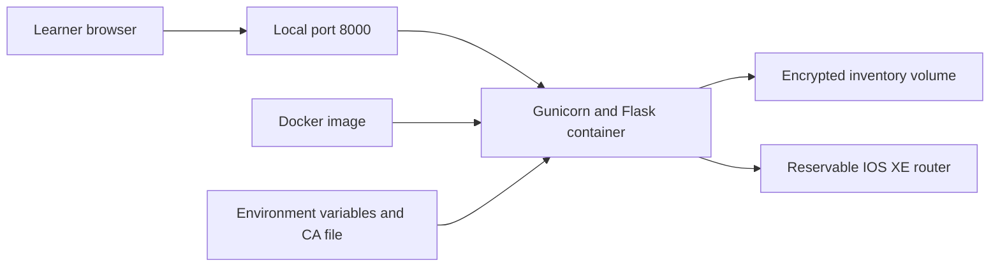
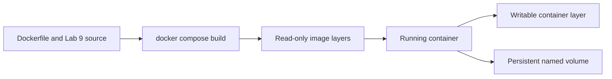
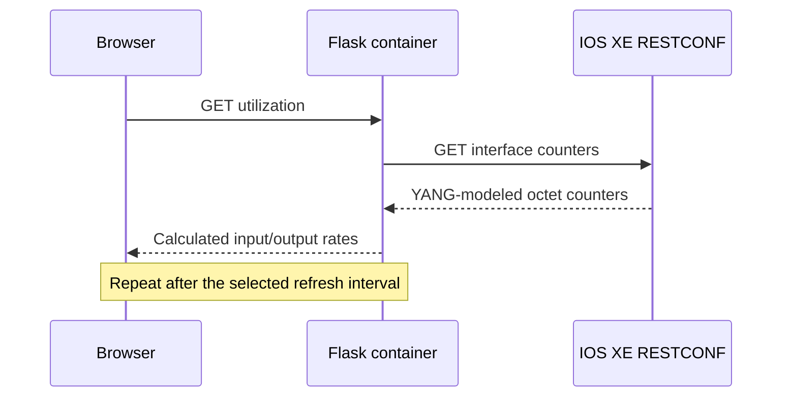

# Lab 10: Containerize the RESTCONF Management Console

## Duration

**2 hours**

Lab 9 ran the Flask management console directly from a Python virtual environment. In this lab, you will package the same application and its runtime dependencies into a Docker image, start it with Docker Compose, verify its health, preserve its encrypted router inventory in a volume, and confirm that the container can reach a reservable IOS XE router through RESTCONF.

## Objectives

- Explain the relationship between a Dockerfile, image, container, registry, volume, and port mapping.
- Build the Lab 9 Flask application into a reproducible image.
- Run Gunicorn as the application server inside the container.
- Run the application as a non-root user with reduced Linux capabilities.
- Supply secrets through a local environment file rather than embedding them in the image.
- Persist the encrypted SQLite inventory in a named volume.
- Inspect container state, health, logs, and network behavior.
- Rebuild the image after a controlled application change.
- Stop the application and remove lab resources safely.

## Container architecture



The browser reaches the console through `127.0.0.1:8000`. Docker creates the container from the image, injects runtime settings, and mounts persistent inventory storage. RESTCONF requests leave the container through the workstation's sandbox VPN route to the reserved IOS XE router.

## Required environment

- The Ubuntu workstation prepared in Lab 1.
- Docker Engine and the Docker Compose plugin installed in Lab 8.
- The completed `devnet-associate-lab09` repository next to the Lab 10 repository.
- A private, reservable IOS XE sandbox with RESTCONF enabled.
- The sandbox VPN connected before testing router operations.

The supplied build uses the Lab 9 repository as its build context. Keep the two cloned repositories adjacent in the home directory:

```text
~/
├── devnet-associate-lab09/
└── devnet-associate-lab10/
```

## Part 1: Review the container files

On github.com, select **+ > New repository**, enter `devnet-associate-lab10`, select **Public**, add a README, and select **Create repository**. On the new repository page, select **Code > HTTPS** and copy the URL. Clone it, add the supplied container files, and open the project:

```bash
cd ~
git clone https://github.com/YOUR-USERNAME/devnet-associate-lab10.git
cp -R "/path/to/Lab 10 - Containerize the RESTCONF Management Console/." \
  ~/devnet-associate-lab10/
cd ~/devnet-associate-lab10
code .
```

The project contains:

```text
lab10/
├── Lab10.md
├── Dockerfile
├── compose.yaml
├── .env.example
├── .gitignore
├── verify_container.py
└── certificates/
    └── .gitkeep
```

The Lab 9 `.dockerignore` file prevents its virtual environment, secrets, local database, tests, and documentation from entering the build context. The Dockerfile then performs six main actions:

1. Starts from the official Python 3.12 slim image.
2. Sets predictable Python runtime behavior.
3. Creates an unprivileged `app` account.
4. Installs Lab 9 dependencies and Gunicorn.
5. Copies only the application files selected by the Dockerfile.
6. defines a health check and starts Gunicorn on container port `8000`.

Gunicorn uses one worker with four threads in this lab. Lab 9 keeps recent interface-counter samples in process memory, so multiple independent worker processes would maintain different histories and could produce discontinuous chart calculations. A production multi-worker design would move sample history to a shared service such as Redis or a time-series database.



The image is the packaged template. A container is a running instance of that image. The container's writable layer is temporary; the named volume has a separate lifecycle and preserves inventory across container replacement.

## Part 2: Prepare runtime secrets

Create `.env` and restrict access:

```bash
cp .env.example .env
chmod 600 .env
python3 - <<'PY'
import secrets
from cryptography.fernet import Fernet

print("FLASK_SECRET_KEY=" + secrets.token_urlsafe(32))
print("INVENTORY_ENCRYPTION_KEY=" + Fernet.generate_key().decode())
PY
```

If `cryptography` is unavailable in the workstation's current Python environment, activate the Lab 9 virtual environment before running the generator. Copy the two generated values into `.env`.

Do not reuse the example values. Do not place secrets in the Dockerfile, Compose file, image, or Git repository. Docker Compose reads `.env` when it creates the container and passes the variables at runtime.

Keep the same `INVENTORY_ENCRYPTION_KEY` for the entire lifecycle of the named inventory volume. Generating a different key while retaining the volume makes previously stored router credentials unreadable. If the key is intentionally replaced, remove and recreate the inventory volume, then add the routers again.

If the router uses a certificate issued by a private CA:

1. Copy only the CA certificate—not a private key—to `certificates/router-ca.pem`.
2. Set `LAB_CA_BUNDLE=/certificates/router-ca.pem` in `.env`.
3. Confirm that Git ignores the certificate.

Leave `LAB_CA_BUNDLE` empty when the router uses a certificate trusted by the container's standard CA store. Do not replace certificate validation with `verify=False`.

## Part 3: Build the image

Validate the resolved Compose configuration. This command displays configuration, so inspect the terminal environment and do not share its output when it contains secrets:

```bash
docker compose config --quiet
```

Build the image:

```bash
docker compose build
docker image ls devnet/restconf-console
docker image inspect devnet/restconf-console:lab10 \
  --format 'Architecture={{.Architecture}} Size={{.Size}} Created={{.Created}}'
```

During the first build, Docker downloads the base image and Python packages. Later builds reuse unchanged layers. Placing dependency installation before application source code lets a source-only change reuse the dependency layer.

Confirm that credentials were not copied into the image:

```bash
docker run --rm --entrypoint sh devnet/restconf-console:lab10 \
  -c 'test ! -e /app/.env && echo "No .env file in image"'
```

## Part 4: Run and verify the container

Start the service in the background:

```bash
docker compose up -d
docker compose ps
docker compose logs --tail=50 console
```

Wait until the health column reports `healthy`, then run the read-only verification:

```bash
python3 verify_container.py
curl -sS http://127.0.0.1:8000/api/routers | jq
```

Open `http://127.0.0.1:8000`. The port mapping listens only on the workstation's loopback address, so another host cannot connect directly. The container listens on port `8000`; Docker publishes that port as `127.0.0.1:8000` on the workstation.

Inspect the runtime identity and restrictions:

```bash
docker compose exec console id
docker inspect lab10-restconf-console \
  --format 'User={{.Config.User}} ReadonlyRootfs={{.HostConfig.ReadonlyRootfs}} CapDrop={{json .HostConfig.CapDrop}}'
```

The process must run as the unprivileged `app` user, `no-new-privileges` must be enabled, and all Linux capabilities must be dropped. The root filesystem remains writable for this beginner lab, while application persistence is deliberately assigned to the volume.

## Part 5: Test persistent inventory

Use the GUI to add one permitted sandbox router. Do not add a production router. Confirm that the inventory API returns the router without returning its password:

```bash
curl -sS http://127.0.0.1:8000/api/routers | jq
```

Recreate the container:

```bash
docker compose down
docker compose up -d
python3 verify_container.py
```

Refresh the Inventory tab. The router remains because `inventory_data` is mounted at `/app/instance`, where Lab 9 stores its SQLite database.

Inspect the volume without exposing database contents:

```bash
docker volume ls --filter name=inventory_data
docker volume inspect "$(docker volume ls -q --filter name=inventory_data)"
```

`docker compose down` removes containers and the Compose network but retains named volumes. `docker compose down --volumes` also deletes the inventory volume and its encrypted contents.

## Part 6: Confirm RESTCONF and traffic monitoring

Connect the sandbox VPN before starting or restarting the container. In the GUI, select the router and retrieve routes and loopbacks. Open the Dashboard and allow at least two refresh intervals so that the application can calculate GigabitEthernet1 rates from consecutive counter samples.



If inventory works but device data fails, inspect logs first:

```bash
docker compose logs --tail=100 console
```

Then verify the following without disabling application safeguards:

- The sandbox reservation is Ready and its VPN remains connected.
- The inventory address, credentials, and RESTCONF port match the current reservation.
- The container was started after the VPN connected.
- Docker traffic is permitted through the VPN client policy.
- The CA file exists inside the container when `LAB_CA_BUNDLE` is set.
- Lab 9's model paths match the router's advertised YANG models.

Check an optional mounted CA path without printing its content:

```bash
docker compose exec console sh -c \
  'if [ -n "$LAB_CA_BUNDLE" ]; then test -r "$LAB_CA_BUNDLE" && echo "CA file readable"; else echo "Using system CA store"; fi'
```

## Part 7: Rebuild after a controlled change

In the Lab 9 source, change the page title in `templates/index.html` from `IOS XE Management Console` to `Containerized IOS XE Management Console`. Rebuild and recreate:

```bash
docker compose up -d --build
docker compose ps
```

Refresh the browser and confirm the new title. Review the build output and identify which layers were cached. Restore the original Lab 9 title afterward, then rebuild once more so that the shared Lab 9 source remains consistent for later use.

## Part 8: Clean up and publish

Remove any routes or loopbacks created while testing. Remove the sandbox router from Inventory if the workstation will be reassigned. Stop and remove the container while retaining the volume:

```bash
docker compose down
```

When the instructor confirms that saved inventory is no longer required, remove the volume and image:

```bash
docker compose down --volumes
docker image rm devnet/restconf-console:lab10
```

Confirm that no secret or certificate is staged, then publish the reusable Lab 10 files:

```bash
git status --ignored
git add Lab10.md Dockerfile compose.yaml .env.example .gitignore \
  verify_container.py certificates/.gitkeep
git diff --staged
git commit -m "Containerize the Flask RESTCONF console"
git push
```

The `.dockerignore` file belongs to the separate Lab 9 project and must be committed from the Lab 9 repository. Git cannot stage a file outside the current repository.

## Completion criteria

- Compose builds `devnet/restconf-console:lab10` successfully.
- The container runs as a non-root user with all Linux capabilities dropped.
- The health check reports `healthy` and `verify_container.py` passes.
- The GUI is available only through `127.0.0.1:8000`.
- Runtime secrets and certificates are absent from the image and Git.
- Router inventory survives container recreation through the named volume.
- RESTCONF retrieval and the GigabitEthernet1 chart work through the sandbox VPN.
- A source change is incorporated through a controlled image rebuild.
- Lab-created router configuration and unneeded container resources are removed.

## Further references

- [Dockerfile reference](https://docs.docker.com/reference/dockerfile/)
- [Docker Compose documentation](https://docs.docker.com/compose/)
- [Docker volumes](https://docs.docker.com/engine/storage/volumes/)
- [Docker container security](https://docs.docker.com/engine/security/)
- [Gunicorn documentation](https://docs.gunicorn.org/)

## Key takeaways

- A Dockerfile describes how source code and dependencies become an immutable image; Compose describes how the container runs.
- Runtime secrets must be injected when the container starts and excluded from image layers and source control.
- A named volume separates persistent inventory data from the replaceable container lifecycle.
- Port publishing, user identity, capabilities, health checks, logs, and restart behavior are operational parts of application deployment.
- Containers share the host kernel and depend on host networking policy, including the sandbox VPN route.
- Rebuilding and replacing a container is preferable to making undocumented changes inside a running container.
